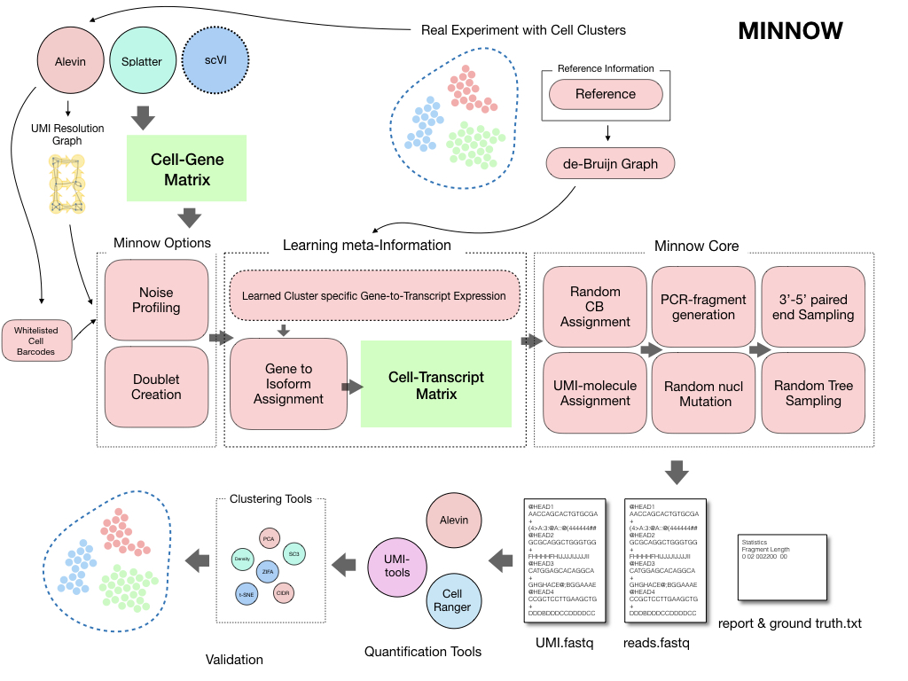

[](https://travis-ci.org/COMBINE-lab/minnow)
[](https://gitter.im/minnow-sim?utm_source=badge&utm_medium=badge&utm_campaign=pr-badge&utm_content=badge)

# Minnow ( read level simulator for dscRNA-seq data)


Most analysis pipelines validate their results using known marker genes (which are not widely available for all types of analysis) and by using simulated data from gene-count-level simulators. Typically, the impact of using different read-alignment or UMI deduplication methods has not been widely explored. Assessments based on simulation tend to start at the level of assuming a simulated count matrix, ignoring the effect that different approaches for resolving UMI counts from the raw read data may produce. Here, we present minnow, a comprehensive sequence-level droplet-based single-cell RNA-seq (dscRNA-seq) experiment simulation framework.  Minnow accounts for important sequence-level characteristics of experimental scRNA-seq datasets and models effects such as PCR amplification,  CB (cellular barcodes) and UMI (Unique Molecule Identifiers) selection, and sequence fragmentation and sequencing. 

Minnow is a read level simulator for droplet based single cell RNA-seq data. Minnow simulates the reads by sampling sequences from the underlying de-Bruijn graph (using `--dbg`) of the reference transcriptome or alternatively just samples sequences from the reference transcriptome. As the `--dbg` option also enables other features of the software, it is useful to describe those.

<p align="center">

</p>

## Pre-build images

[docker](`docker pull hrksrkr/minnow`)

[tutorial](https://combine-lab.github.io/alevin-tutorial/2019/running-minnow/)


## Installation 
Minnow is written in C++14 and tested in a ubuntu server, please let us know if you have difficulty compiling it in your own machine.

```console
git clone https://github.com/COMBINE-lab/minnow.git
cd minnow
mkdir build
cd build
cmake ..
make
```
Given the above steps run withot error, the binary will be stored within the `build/src`.

## Main input options
In terms of input currently minnow works in two different modes, 1. `alevin-mode` and 2. `splatter-mode`. Although it can be be made to work with other matrices given the input is provided with correct format.

### `alevin-mode`
This works now with binary flag `--binary` as most by default alevin writes a binary files. The minimal requirement of alevin directory are `quants_mat.gz`, `quants_mat_rows.txt`, `quants_mat_cols.txt`.

A typical example (minimal) 

```console
src/minnow simulate --alevin-mode --binary --g2t <transcript_to_gene_file> -m <alevin_dir_run_on_real_data> -r <fasta_file> --PCR 8 -e 0.001 -p 2 -o <output>
```
Optionally using `whitelist` produced by alevin

```console
src/minnow simulate --alevin-mode --binary --g2t <transcript_to_gene_file> -m <alevin_dir_run_on_real_data> -r <fasta_file> --PCR 8 -e 0.001 -p 2 -o <output> --useWhiteList
```

### `splatter-mode`
 
In `splatter-mode`, just like in alevin mode minnow accepts at least three different files, in the same format, `quants_mat.csv`, `quants_mat_cols.txt`, `quants_mat_rows.txt`. Although splatter matrix is a gene to cell matrix. While running splatter it is easy to create this format by inserting few lines after running splatter.
Below is an example,

 

```R
sim <- splatSimulate( 
	nGenes=num_genes, 
	batchCells=num_cells, 
	verbose = FALSE
)
write.table(rownames(sim), file= file.path(out_dir, "quants_mat_rows.txt"), quote=FALSE, col.names=FALSE, row.names=FALSE)
write.table(colnames(sim), file= file.path(out_dir, "quants_mat_cols.txt"), quote=FALSE, col.names=FALSE, row.names=FALSE)
write.table(counts(sim), file= file.path(out_dir, "quants_mat.csv"), quote=FALSE, col.names=FALSE, row.names=FALSE, sep=",")  

```


## Main model options 

### How to generate a right `gfa` file given a particular `READ_LEN`

#### Run [TwoPaCo](https://github.com/medvedevgroup/TwoPaCo)

```console
# delete non unique k-mers of length <READ_LEN>
fixFasta --klen <READ_LEN+1> --input <fasta_file> --output <fixed_fasta_file> 

# delete duplicated sequences 
seqkit rmdup -s  <fixed_fasta_file> > <dedup_fasta>

# run TwoPaCo to produce gfa
TwoPaCo/build/graphconstructor/twopaco -k <READ_LEN+1> -t 10 -f 20 <dedup_fasta> --outfile dbg.bin --tmpdir /tmp/

TwoPaCo/build/graphdump/graphdump <tr.gfa> -k <READ_LEN+1> -s <fasta_file> -f gfa1 dbg.bin


```
The above process are required to be executed sequencially, 

#### -OR- download files 

for ease of use we uploaded the de-Bruijn graph and reference transcripts are uploaded in zenodo. 

[](https://doi.org/10.5281/zenodo.2556439)


### `--dbg`-mode 
Minnow accepts a de-Bruijn graph in gfa format. (produced by TwoPaCo)

In `--dbg` mode minnow accepts few additional options, such as `--gfa` (required), `--bfh` (optional), `--rspd` (optional). The repository currently contains two different probability files estimated from `10X pbmc 4k` dataset. If `--dgb` option is provided without any of `--bfh`, `--geneProb` or `--countProb` is provided, those default files will be read.

### Default mode
In default mode `weibull` distribution is used. 


### Example files 
```
gene prob file - data/hg/geneLebelProb_pbmc_4k.txt
gene prob file - data/hg/countProb_pbmc_4k.txt
transcript to gene - data/hg/hg_t2g.tsv
```

## Complete examples

### `--alevin-mode` + `--dbg` + `--geneProb`


```console
src/minnow simulate --alevin-mode --binary --g2t <transcript_to_gene_file> -m <alevin-dir>/alevin --PCR <PCR-cycle> -r <fasta_file> -e <error_rate < 1> -p <#threads> 2> -o <out_dir> --useWhiteList --dbg --gfa <gfa_file> --geneProb <gene_prob_file> --rspd <fragment_length_dist_file> -s <#samples>

```

### `--alevin-mode` + `--dbg` + `--bfh`


```console
src/minnow simulate --alevin-mode --binary --g2t <transcript_to_gene_file> -m <alevin-dir>/alevin --PCR <PCR-cycle> -r <fasta_file> -e <error_rate < 1> -p <#threads> 2> -o <out_dir> --useWhiteList --dbg --gfa <gfa_file> --bfh <bfh_file> --rspd <fragment_length_dist_file> -s <#samples>

```

### `--splatter-mode` + `--dbg`

```console
src/minnow simulate --splatter-mode --g2t <transcript-gene> -m <alevin-dir> --PCR <PCR-cucle> -r <fasta_file> -e <error-rate> -p <#threads> -o <out_dir> --dbg --gfa <gfa_file> --bfh <bfh_file>
```

### `--splatter-mode` + `--useWeibull` (Create favorable example)

```console
src/minnow simulate --splatter-mode --g2t /mnt/scratch6/avi/data/cgat/references/metadata/hg_t2g.tsv -m ../example_data/splatter_data_100_Cells_50K_Genes_pbmc/ --PCR 7 -r /mnt/scratch6/avi/data/cgat/references/txome/hg_transcriptome.fasta -e 0.01 -p 25 -o <out_dir> --useWeibull --testUniqness --reverseUniqness
```


### Things to be added
1. [x] Doublets
2. [ ] Empty-drops
3. [ ] Retained intron
4. [x] Clusters 
